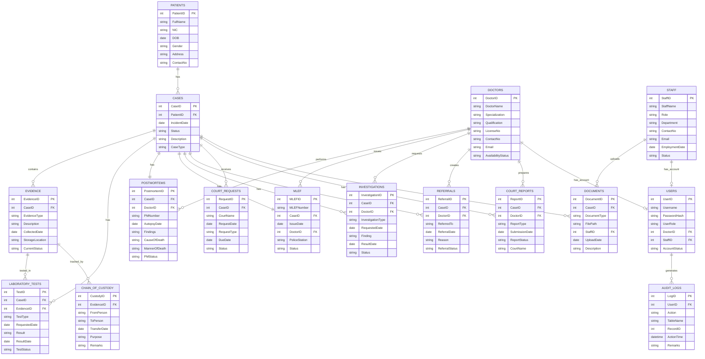

# 🏥 Forensic Medical Department Database System

A relational database system developed for the Department of Forensic Medicine to replace manual paper-based record management with a secure and efficient computerized solution.

---

## 📌 Project Overview

This project was developed as part of the **Database Systems Mini Project**.

The system manages forensic medical records, including patient information, medico-legal cases, postmortem examinations, evidence, laboratory tests, court reports, and staff information. It demonstrates the complete database development lifecycle, from database design to implementation.

---

## 🎯 Objectives

- Design a normalized relational database
- Store and manage forensic medical records
- Maintain data integrity using constraints
- Improve data retrieval using indexes
- Simplify reporting using SQL views
- Demonstrate database programming using procedures and triggers

---

## 🛠 Technologies Used

- MySQL
- DBeaver
- SQL
- Git & GitHub

---

## 📂 Project Structure

```
Forensic-Database-System/
│
├── Database/
│   ├── 01_create_database.sql
│   ├── 02_create_tables.sql
│   ├── 03_primary_foreign_keys.sql
│   ├── 04_check_constraints.sql
│   ├── 05_indexes.sql
│   ├── 06_views.sql
│   ├── 07_stored_procedures.sql
│   ├── 08_triggers.sql
│   ├── 09_sample_data.sql
│   └── 10_sample_queries.sql
│
├── ERD/
│
├── Screenshots/
│
├── Report/
│
└── README.md
```

---

## 🗄 Database Modules

The system contains the following modules.

- Patient Management
- Case Management
- Postmortem Management
- Evidence Management
- Laboratory Test Management
- Court Report Management
- Staff Management
- User Authentication

---

## 🏗 Database Design

The database consists of multiple related tables connected using primary and foreign keys.

Main entities include:

- Patients
- Cases
- Doctors
- Staff
- Postmortem
- Evidence
- LaboratoryTests
- CourtReports
- Users
- Orders (if applicable)

---

## ⚙ Features Implemented

- ✔ Database creation
- ✔ Table creation
- ✔ Primary Keys
- ✔ Foreign Keys
- ✔ CHECK Constraints
- ✔ UNIQUE Constraints
- ✔ DEFAULT Constraints
- ✔ Indexes
- ✔ SQL Views
- ✔ Stored Procedures
- ✔ Triggers
- ✔ Sample Data
- ✔ SQL Queries

---

## 🚀 How to Run


3. Execute the SQL files in the following order.

```
01_create_database.sql
02_create_tables.sql
03_primary_foreign_keys.sql
04_check_constraints.sql
05_indexes.sql
06_views.sql
07_stored_procedures.sql
08_triggers.sql
09_sample_data.sql
10_sample_queries.sql
```

---

## 📊 SQL Features Used

- CREATE DATABASE
- CREATE TABLE
- PRIMARY KEY
- FOREIGN KEY
- CHECK
- UNIQUE
- DEFAULT
- INDEX
- VIEW
- STORED PROCEDURE
- TRIGGER
- INSERT
- UPDATE
- DELETE
- SELECT
- JOIN
- GROUP BY
- Aggregate Functions

---

## 📸 Screenshots

Add screenshots of:

- Database tables
- ER Diagram
- Views
- Stored Procedures
- Triggers
- Query Results

---


---

## 📄 License

This project was developed for academic purposes.


